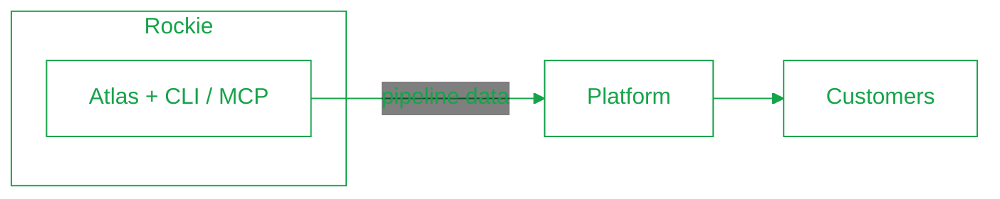

Agteria builds a discovery pipeline (**Atlas**) that runs inside a partner-hosted environment (**Rockie**). The **Platform** turns that pipeline's output into something our customers can see.

<Info>
  This describes the architecture we're **building toward**. Today, `agteria-platform` is still the older all-in-one monolith — the split below is the direction, not the current state.
</Info>

Ownership splits along one line: **Agteria owns Atlas and the Platform**; the **partner owns Rockie and the harness/interface**.

## The pieces

- **Atlas** — Agteria's discovery pipeline: the tools and modules that identify a target and design molecules against it. It's our code, in our GitHub, deployed into Rockie via CI/CD. This is Agteria's core IP.
- **Rockie** — the partner-hosted environment the pipeline runs in, customized for Agteria. The partner also built the harness and the CLI / MCP interface that exposes pipeline data.
- **Platform** — Agteria's customer-facing product. It keeps a backend, but not the one running the pipeline; it reads Atlas's output through the CLI / MCP boundary and presents it to customers.

## Where to go deeper

Each Agteria-owned system has its own section under [Projects](/projects/overview) with setup, internal architecture, and runbooks. For what we build with and why, see the [tech stack](/architecture/tech-stack).
